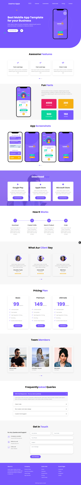

# app-landing-page-simple-bootstrap
Install Bootstap 4 or copy all the files in each folder
In JS folder inside Index.js there is a structure file
In js folder there is JQuery file main.js for functionalities of App 
In CSS  there is main.css for all styled and responsive quries

# This is for mobile Screen
